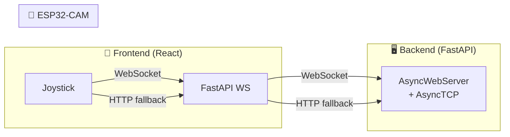

# 🔌 Análisis: WebSocket para Control de Motores

## Veredicto: ✅ Excelente idea, totalmente viable

La idea es **muy buena** y encaja perfectamente con tu arquitectura actual. Vamos por partes:

---

## 📊 HTTP actual vs WebSocket — Comparativa

| Aspecto | HTTP actual (`/api/move`) | WebSocket propuesto |
|---|---|---|
| **Latencia por comando** | ~30-80ms (TCP handshake + HTTP overhead) | ~1-5ms (canal ya abierto) |
| **Overhead por mensaje** | ~400 bytes headers HTTP | ~6 bytes frame WS |
| **Conexión** | Nueva por cada comando (keep-alive mitiga parcialmente) | Persistente, bidireccional |
| **Rate de envío** | ~12 cmd/s (limitado por tu intervalo de 80ms) | Fácilmente **50-100 cmd/s** |
| **Watchdog necesario** | Sí (1s timeout en backend) | Opcional — el cierre del WS = stop |
| **Movimiento diagonal** | ❌ Solo 4 direcciones cardinales | ✅ Se puede enviar `{leftSpeed, rightSpeed}` directamente |

> [!TIP]
> El mayor beneficio no es solo la latencia baja — es que puedes enviar **velocidades independientes por motor**, lo que habilita el "steering" suave (curvas, diagonales).

---

## 🎯 El concepto de "Verticalidad" — Dirección Diferencial

Tu idea de mezclar izquierda/derecha es exactamente **dirección diferencial (differential steering)**. En vez de mandar `"forward"` o `"left"`, envías directamente las velocidades de cada motor:

```
Recto:     leftMotor=200, rightMotor=200
Curva suave derecha: leftMotor=200, rightMotor=100
Giro fuerte derecha: leftMotor=200, rightMotor=0
Giro sobre sí mismo: leftMotor=200, rightMotor=-200
```

El joystick ya calcula `(x, y)` — solo hace falta convertir a velocidades de motor:

```
leftSpeed  = clamp((y + x) * maxSpeed, -255, 255)
rightSpeed = clamp((y - x) * maxSpeed, -255, 255)
```

Esto mapea directamente el stick analógico a movimiento suave y continuo.

---

## 🏗️ Arquitectura propuesta (conviviendo con HTTP)



### Dos opciones de arquitectura:

### Opción A: WebSocket directo Frontend → ESP32 (recomendada si no necesitas proxy)
- Menor latencia absoluta (eliminas el hop del backend)
- Pero el frontend necesita conocer la IP del ESP32

### Opción B: WebSocket Frontend → Backend → ESP32 (recomendada para tu caso)
- El backend ya gestiona la IP del ESP32
- Puedes añadir lógica (logs, limitación, telemetría)
- El frontend solo habla con el backend (como ahora)
- **Es la que encaja con tu arquitectura actual**

---

## 🔧 Implementación — Las 3 capas

### 1️⃣ ESP32 Firmware (ESPAsyncWebServer + AsyncTCP)

> [!IMPORTANT]
> Necesitas cambiar de `esp_http_server.h` a **ESPAsyncWebServer**, que soporta WebSocket nativo. Ambos servidores **pueden convivir**: HTTP en puerto 80 y WS en el mismo o diferente puerto.

```cpp
// Pseudocódigo del handler WS en el ESP32
void onWsEvent(AsyncWebSocket *server, AsyncWebSocketClient *client, 
               AwsEventType type, void *arg, uint8_t *data, size_t len) {
    if (type == WS_EVT_DATA) {
        // Mensaje esperado: "L:200,R:150" (6-11 bytes)
        // Parsear y aplicar directamente a motores
        int leftSpeed, rightSpeed;
        sscanf((char*)data, "L:%d,R:%d", &leftSpeed, &rightSpeed);
        
        applyMotors(leftSpeed, rightSpeed);
        lastCommandTime = millis();  // Para watchdog
    }
    if (type == WS_EVT_DISCONNECT) {
        stopMotors();  // Seguridad: desconexión = stop
    }
}
```

### 2️⃣ Backend Python (FastAPI WebSocket relay)

```python
# Pseudocódigo en main.py
@app.websocket("/ws/motor")
async def motor_websocket(ws: WebSocket):
    await ws.accept()
    # Abrir WS hacia ESP32
    async with websockets.connect(f"ws://{_current_esp32_ip}/ws") as esp_ws:
        try:
            while True:
                data = await ws.receive_text()  # Del frontend
                await esp_ws.send(data)          # Al ESP32
        except WebSocketDisconnect:
            await esp_ws.send("L:0,R:0")         # Safety stop
```

### 3️⃣ Frontend (JoystickControl.tsx)

```typescript
// En vez de HTTP polling cada 80ms, un WS abierto:
const ws = new WebSocket(`ws://${backendIp}:8000/ws/motor`);

// En cada frame del joystick:
const leftSpeed  = Math.round(clamp((y + x) * 255, -255, 255));
const rightSpeed = Math.round(clamp((y - x) * 255, -255, 255));
ws.send(`L:${leftSpeed},R:${rightSpeed}`);
```

---

## ⚠️ Consideraciones importantes

> [!WARNING]
> ### Recursos del ESP32-CAM
> El ESP32-CAM ya está usando bastante RAM con el stream de vídeo. `ESPAsyncWebServer` usa más RAM que `esp_http_server`. Monitoriza el heap libre con `ESP.getFreeHeap()` durante las pruebas.

> [!NOTE]
> ### Compatibilidad con tu sistema actual
> - El servidor HTTP actual en puerto 80 (`/action?go=...`) **sigue funcionando** como fallback
> - El stream MJPEG en puerto 81 no se toca
> - El WebSocket puede ir en el **mismo puerto 80** con ESPAsyncWebServer o en un puerto diferente (ej: 82)

### Protocolo sugerido del mensaje WS

Formato ultra-ligero (texto, ~11 bytes máx):
```
L:200,R:150    → Movimiento diferencial
L:0,R:0        → Stop
```

O binario (4 bytes): `[int16_left, int16_right]` para máxima eficiencia.

---

## 📋 Plan de implementación sugerido

1. **Instalar ESPAsyncWebServer** en el firmware
2. **Añadir handler WS** que reciba `L:xxx,R:xxx` y controle motores directamente
3. **Mantener HTTP** como fallback (no tocar nada existente)
4. **Backend**: añadir endpoint `@app.websocket("/ws/motor")` que haga relay
5. **Frontend**: añadir opción en JoystickControl para usar WS cuando disponible
6. **Dirección diferencial**: modificar `snapToCardinal` para generar `(leftSpeed, rightSpeed)` en vez de `(direction, speed)`

> [!TIP]
> Podrías empezar solo con el paso 1-3 (ESP32 + test directo desde navegador) para validar la latencia, y luego integrar con el backend y frontend.

---

## 🤔 ¿Quieres que lo implementemos?

Si te convence, puedo empezar por cualquiera de estas capas. Mi recomendación sería:
1. Primero el **firmware ESP32** (la pieza más crítica)
2. Después el **backend relay**
3. Finalmente la **integración en el joystick**
